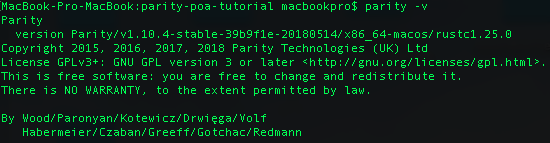
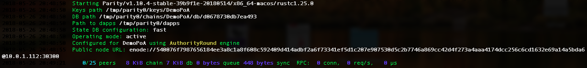
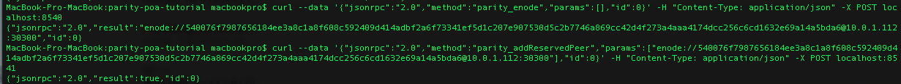
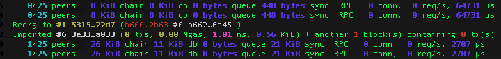

# PoA Network

## Implementations of Proof-of-Authority Consensus

> PoA algorithms rely on a set of N trusted nodes called the authorities. Each authority is identified by a unique id and a majority of them is assumed honest, namely at least N/2 + 1. The authorities run a consensus to order the transactions issued by clients.

There are two popular implementations of PoA consensus such as **Aura** and **Clique**.


**Aura vs Clique**

Aura in comparison to Clique requires additional step for block acceptance by other authorities.


In this article we'll focus on Aura algorithm because its mode of action is more interesting than Clique algo.

It's worth to mention that each block proposals must have a mining leader - one of the authorities node. In the picture below node with id 0 is elected to be the one.


## How Aura works?

Aura is the PoA algorithm implemented in Parity, the Rust-based Ethereum client. 

### Queues and blocks

> Authorities maintain two queues locally, one for transactions Qtxn and one for pending blocks Qb. Each issued transaction is collected by authorities in Qtxn. For each step, the leader l includes the transactions in Qtxn in a block b, and broadcasts it to the other authorities. Then each authority sends the received block to the others. If it turns out that all the authorities received the same block b, they accept b by enqueuing it in Qb. Any received block sent by an authority not expected to be the current leader is rejected. The leader is always expected to send a block, if no transaction is available then an empty block has to be sent.


Electing a leader is time-based so authorities have to be synchronized within the same UNIX time.


## How to run PoA network involving Aura?

### Software installation

Install parity software

```bash
brew tap paritytech/paritytech
brew install parity
```

To check if installation was successful type

```text
parity -v
```

You should see an output similar to this:



### Blockchain config file

Then we need to specify configuration file for our blockchain

```text
{    "name": "PWrCoin",    "engine": {        "authorityRound": {            "params": {                "stepDuration": "5",                "validators" : {                    "list": [                        "0x00Bd138aBD70e2F00903268F3Db08f2D25677C9e",                        "0x00Aa39d30F0D20FF03a22cCfc30B7EfbFca597C2"                    ]                }            }        }    },    "params": {        "gasLimitBoundDivisor": "0x400",        "maximumExtraDataSize": "0x20",        "minGasLimit": "0x1388",        "networkID" : "0x2323"    },    "genesis": {        "seal": {            "authorityRound": {                "step": "0x0",                "signature": "0x0000000000000000000000000000000000000000000000000000000000000000000000000000000000000000000000000000000000000000000000000000000000"            }        },        "difficulty": "0x20000",        "gasLimit": "0x5B8D80"    },    "accounts": {        "0x0000000000000000000000000000000000000001": { "balance": "1", "builtin": { "name": "ecrecover", "pricing": { "linear": { "base": 3000, "word": 0 } } } },        "0x0000000000000000000000000000000000000002": { "balance": "1", "builtin": { "name": "sha256", "pricing": { "linear": { "base": 60, "word": 12 } } } },        "0x0000000000000000000000000000000000000003": { "balance": "1", "builtin": { "name": "ripemd160", "pricing": { "linear": { "base": 600, "word": 120 } } } },        "0x0000000000000000000000000000000000000004": { "balance": "1", "builtin": { "name": "identity", "pricing": { "linear": { "base": 15, "word": 3 } } } }    }}
```

### Spin up authority node

Having that file, we can proceed to spinning up our first authority node with following command

```bash
parity --chain demo-spec.json -d /tmp/parity0 --port 30300 --jsonrpc-port 8540 --ui-port 8180 --ws-port 8450 --jsonrpc-apis web3,eth,net,personal,parity,parity_set,traces,rpc,parity_accounts
```



Similarly we spin up second authority node but using different ports, effectively we add +1 to ports used to sping up first node. Don't forget about config file!

```bash
parity --chain demo-spec.json -d /tmp/parity1 --port 30301 --jsonrpc-port 8541 --ui-port 8181 --ws-port 8451 --jsonrpc-apis web3,eth,net,personal,parity,parity_set,traces,rpc,parity_accounts
```

### Create accounts

#### Authority accounts

With following command we will create authority addresses

```bash
curl --data '{"jsonrpc":"2.0","method":"parity_newAccountFromPhrase","params":["node0", "node0"],"id":0}' -H "Content-Type: application/json" -X POST localhost:8540
```

```bash
curl --data '{"jsonrpc":"2.0","method":"parity_newAccountFromPhrase","params":["node1", "node1"],"id":0}' -H "Content-Type: application/json" -X POST localhost:8541
```

#### User account

```bash
curl --data '{"jsonrpc":"2.0","method":"parity_newAccountFromPhrase","params":["user", "user"],"id":0}' -H "Content-Type: application/json" -X POST localhost:8540
```

The difference is in params section, for authority account we provide node + x where x is node number.

### Connecting authority nodes

We need to connect nodes by obtaining enode of node0 and providing it to node1.

We will get enode of node0 with following command

```bash
curl --data '{"jsonrpc":"2.0","method":"parity_enode","params":[],"id":0}' -H "Content-Type: application/json" -X POST localhost:8540
```

Now we should add reserved peer in node1

```bash
curl --data '{"jsonrpc":"2.0","method":"parity_addReservedPeer","params":["enode://c386d83ae59530cff6d802ae77317e5ea75727e30c92667e1f7ab3982662fab21d4e243f610a04def80b3018739494db385ca4ab2a8cd824cbbf00cea339fd74@10.0.1.117:30300"],"id":0}' -H "Content-Type: application/json" -X POST localhost:8541
```



As a result in the logs of both nodes peers will see each other



0/25 peers changed to 1/25 peers!

### First transaction

We will send 1000000000000000000 tokens from ordinary user account to authority

```javascript
curl --data '{"jsonrpc":"2.0","method":"personal_sendTransaction","params":[{"from":"0x004ec07d2329997267Ec62b4166639513386F32E","to":"0x00Bd138aBD70e2F00903268F3Db08f2D25677C9e","value":"0xde0b6b3a7640000"}, "user"],"id":0}' -H "Content-Type: application/json" -X POST localhost:8540
```

### Balance

We can peek account balance with eth\_getBalance method

```bash
curl --data '{"jsonrpc":"2.0","method":"eth_getBalance","params":["0x00Bd138aBD70e2F00903268F3Db08f2D25677C9e", "latest"],"id":1}' -H "Content-Type: application/json" -X POST localhost:8540
```

and we will get account balance

```javascript
{"jsonrpc":"2.0","result":"0x29a2241af62c0000","id":1}
```

## Bibliography:

eprints.soton.ac.uk/415083/2/itasec18\_main.pdf

wiki.parity.io/Demo-PoA-tutorial.html

