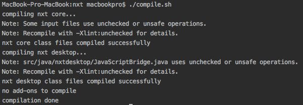
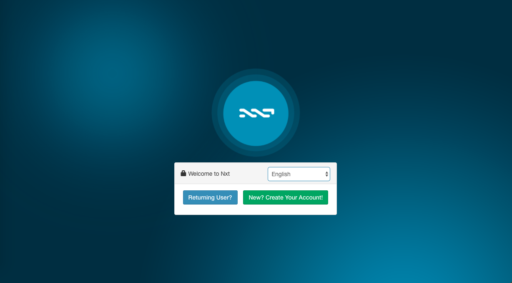
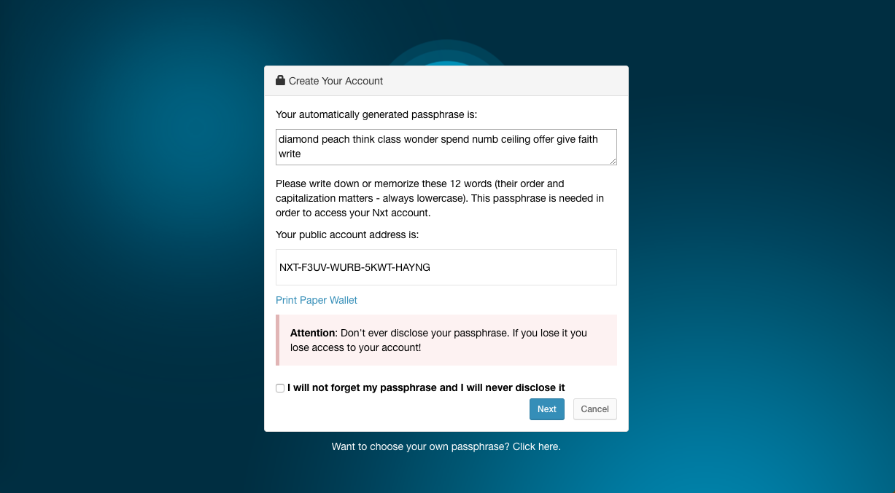
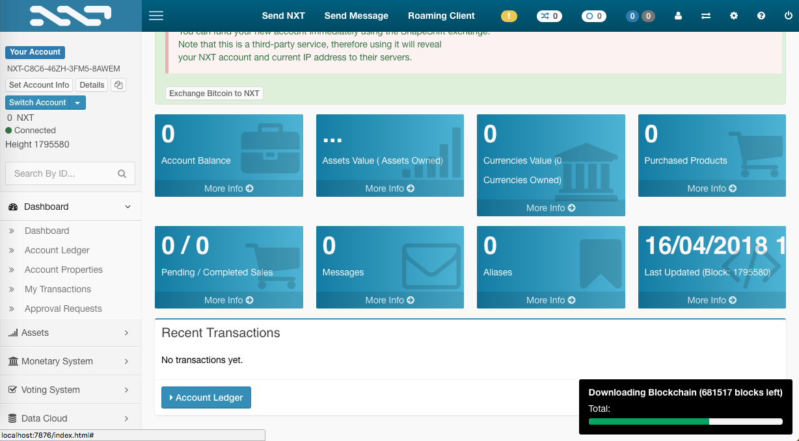

# Coin building


## Project core

In our project we used fully-working open source solutions, took all the best of them and put all of that into PWrCoin. Core of PWrCoin is taken from **NXT** - first not Proof of Work cryptocurrency. NXT source code is available at their [Bitbucket](https://bitbucket.org/Jelurida/nxt/overview). We forked this repository and made changes in it.

## Other propositions

We wanted to build our cryptocurrency on Litecoin, but we have realized that replacing Proof of Work \(which is used in Litecoin\) with Proof of Authority will be much more problematic than changing NXT's Proof of Stake into Proof of Authority. 

#### Litecoin

To use Litecoin, you have to clone Github Litecoin [repository](https://github.com/litecoin-project/litecoin).

_How to build a step-by-step project on a MacOSX system?_ [https://github.com/bitcoin/bitcoin/blob/master/doc/build-osx.md](https://github.com/bitcoin/bitcoin/blob/master/doc/build-osx.md)

In addition, the entire set of instructions on how to create your own cryptocurrency based on the Litecoin code can be found here: [https://vcoin-project.github.io/cloning-litecoin/](https://vcoin-project.github.io/cloning-litecoin/)

## Comparison

|  | **Litecoin** | **PWrCoin** | **NXT** |
| --- | --- | --- | --- | --- | --- | --- |
| Timestamping scheme | _Proof of Work_ | _Proof of Authority_ | _Proof of Stake_ |
| Hash algorithm: | _Script_ | _SHA3-256_ | _SHA3-256_ |
| Default network port: | _9333_ | _10333_ | _7876_ |
| Coins per block: | _25 LTC_ |  | _256_ |
| Total coins: | _84 mln coins_ | _1 mln coins_ | _1 bln \(1,000,000,000\) coins_ |
| Block target:  | _2,5 minutes_ | _1 minute_ | _1 minute_ |

## How we run NXT project

### Install all dependencies

Running NXT locally is fairly straight forward process. We followed succeeding steps:

1. Install Java version 8 from Oracle [http://www.oracle.com/technetwork/java/javase/downloads/jdk8-downloads-2133151.html](http://www.oracle.com/technetwork/java/javase/downloads/jdk8-downloads-2133151.html)
2. `$ git clone git@bitbucket.org:Jelurida/nxt.git`


Be careful! Using Java 9 you may have errors during compilation


### Compile the source code

After preparing dependencies we compiled the project using following script

```
./compile.sh
```

If everything went successfully you will see following logs in the console:



### Run the project

Then we run following script

```text
./run.sh
```

Out desired output is

```text
2018-04-14 10:55:08 INFO: Client UI is at http://localhost:7876/index.html
```

After typing [http://localhost:7876/index.html](http://localhost:7876/index.html) in you browser you will see following screens:








