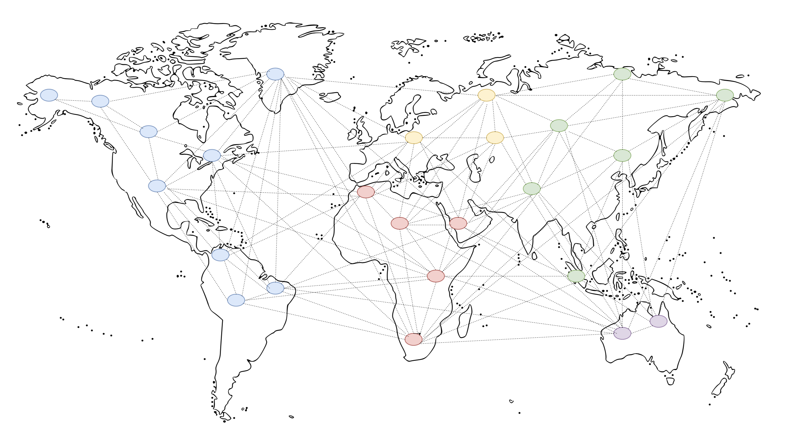

# Coin structure

### Authority nodes

As PWrCoin will use Proof of Authority. Because of that we have to choose authority nodes for our coin. Our decision was to choose every department Dean to be Authority Node. Rector is central and most important person in this process - he creates keys for authority nodes. Deans starts to be validators since they change key received from Rector. 

In the future more University research groups can also become authority nodes.

### Connection between universities

Our cryptocurrency can be applied not only on WUST but on every University in Poland. For this purpouse there will be configuration script which will be run by Rector of each University. In this script Rector will focus on name of cryptocurreny, amount of Authority Nodes and initial amount of coins. Value of each coin on each University will be the same  - it means that there won't be any problems with exchanging different cryptocurrencies between two Universities.

If our cryptocurrency will be successful in Poland, we can think about introducing it on other universities in the world.

Our cryptocurrency would be initiated by the rector of the university. The Rector would give permission to be a validator at the university's deans. Each faculty would receive such a part of cryptocurrencies \(the cryptocurrency has a certain maximum\) depending on the size of the faculty and other factors. Then the deans could exchange their currency if necessary with other deans or ask the dean for more funds for certain legitimate purposes. Transactions could concern some projects, organization of conferences, open days and other initiatives concerning several departments at the same time.

