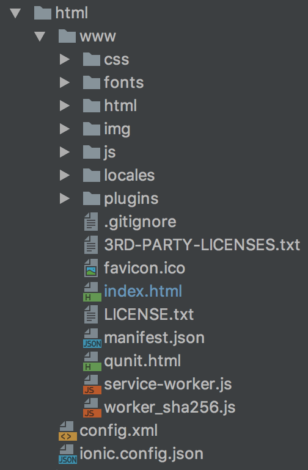
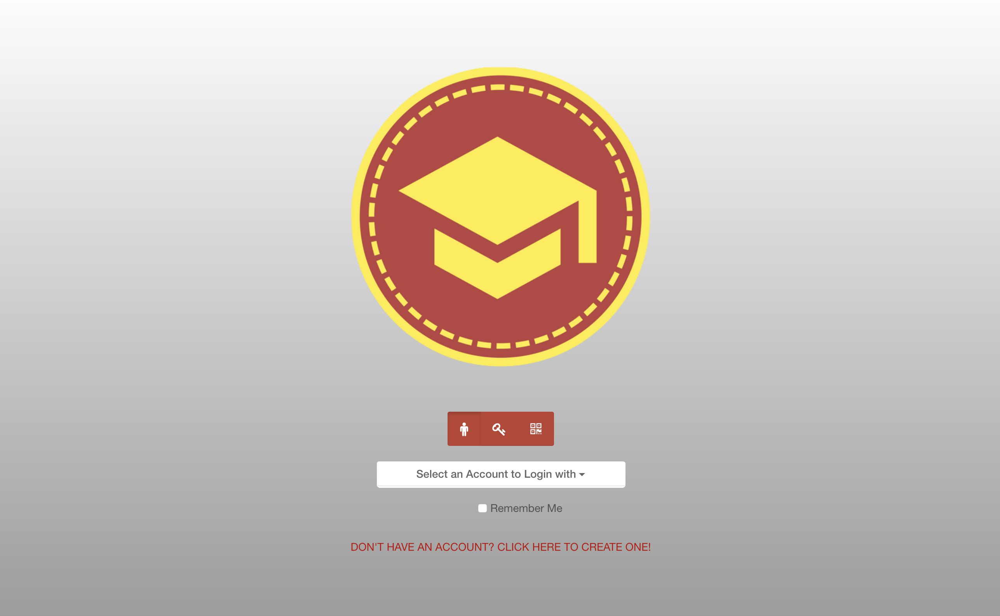
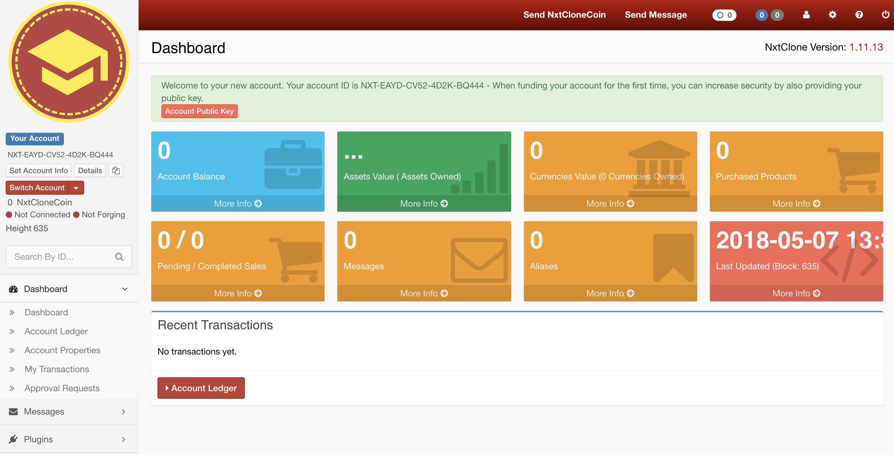

# PWrCoin wallet

We decided to change the frontend of the NXT wallet. We added our own logo and changed the colors. We also removed part of the wallet's functionality that we will not use.

All changes done in the package:



Most changes concerned files: 

```text
dashboard.html
header.html
lockscreen.html
app.css
```

In addition, we removed some script sources in the __**index.html** __file, which concerned the functionalities we didn't need.

Our lockscreen looks like this:



Our dashboard looks like this: 




