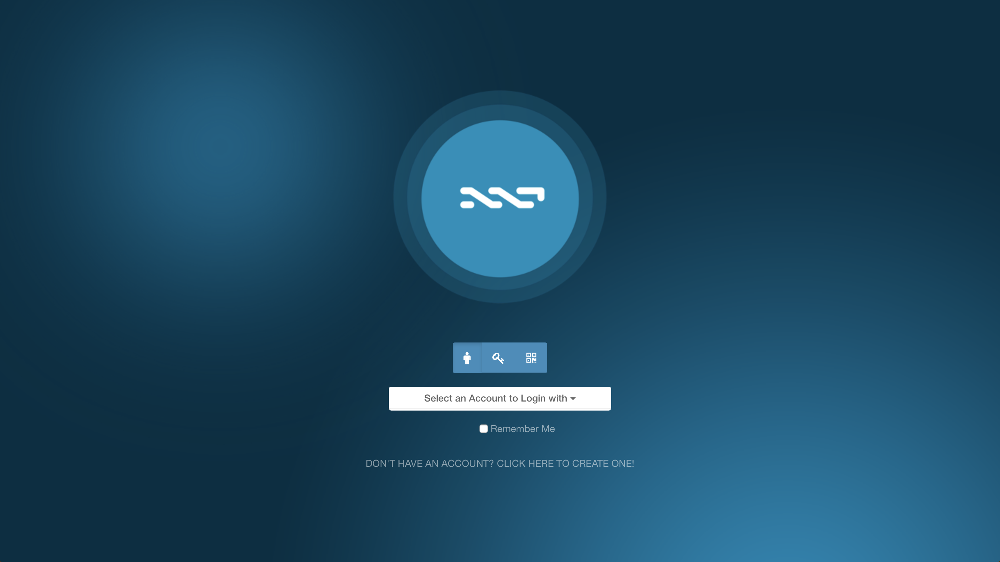
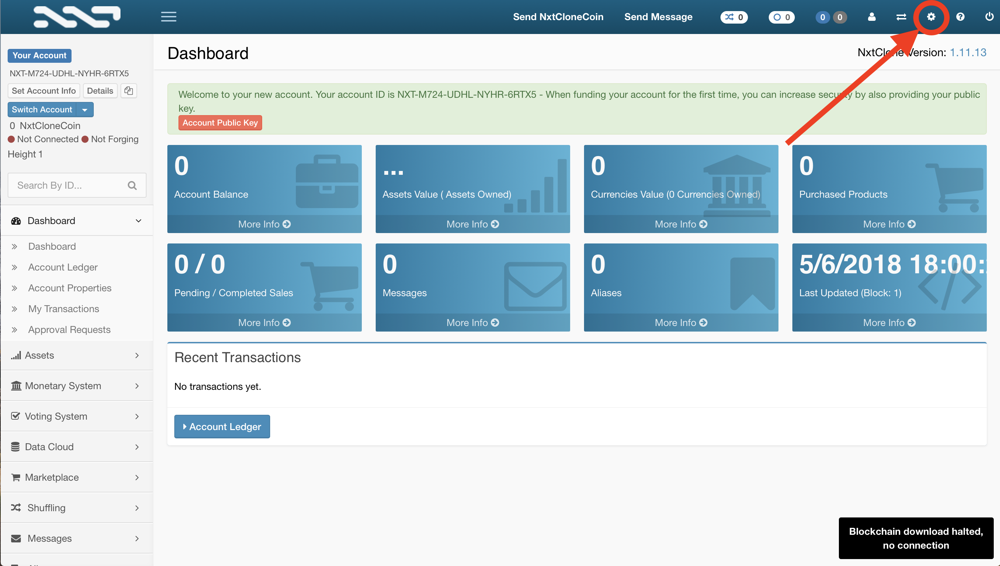
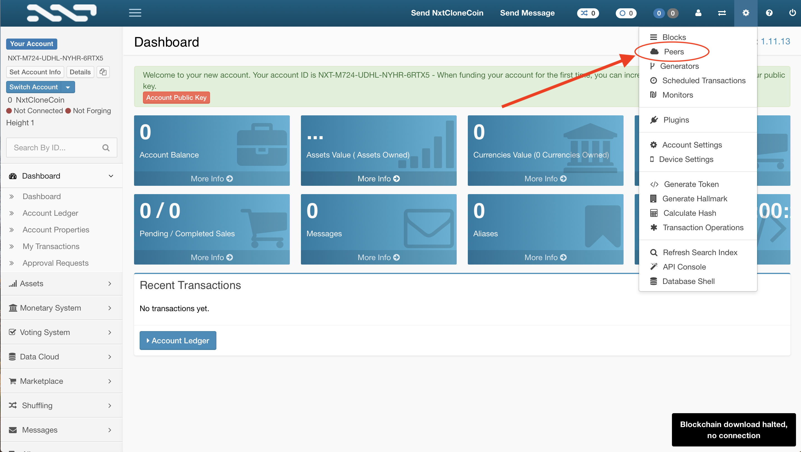
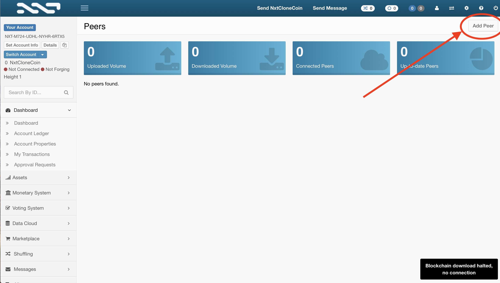
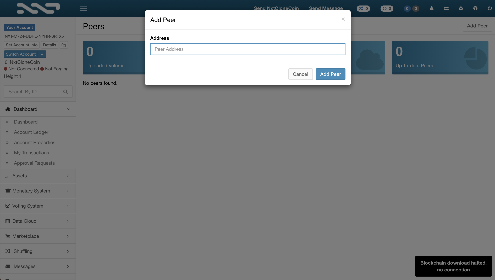
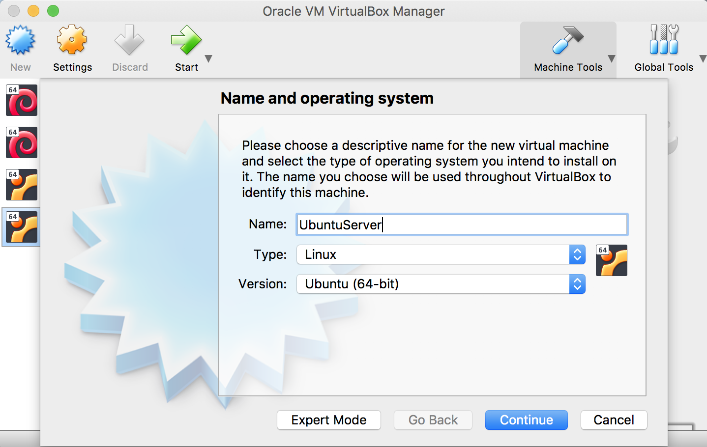
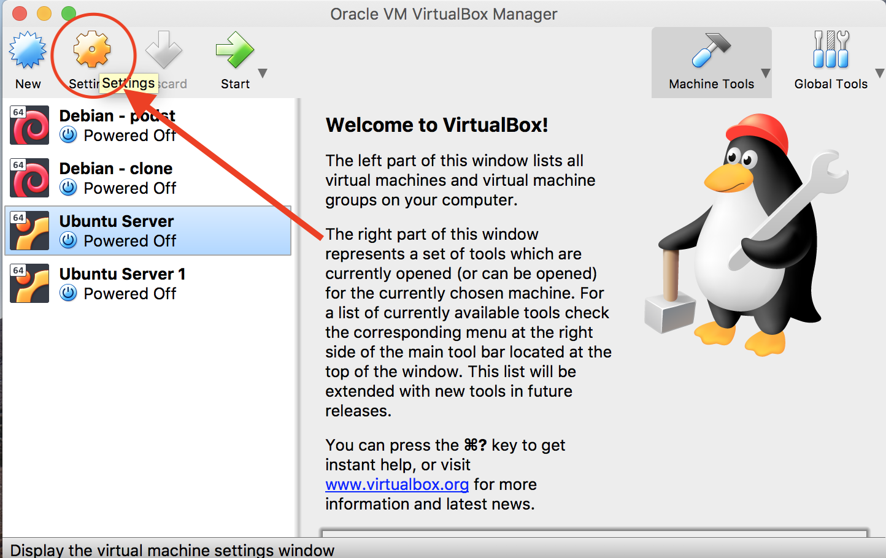
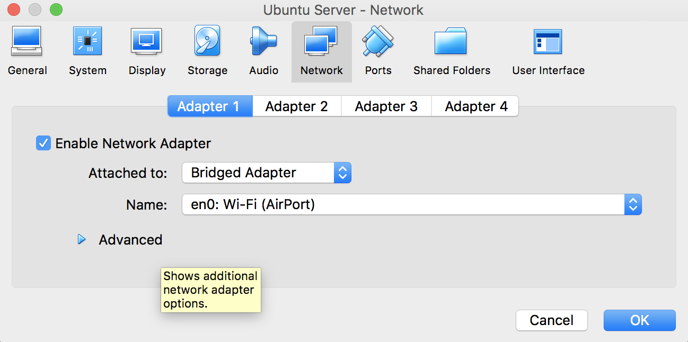
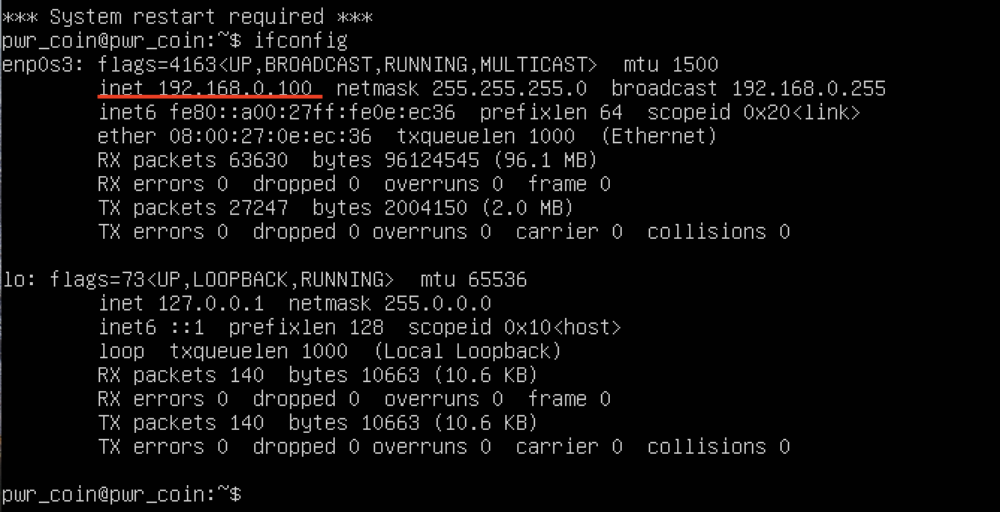

# Testing

**How will we test and simulate our cryptocurrency?**

We have two options. 

* The first is to create a few Linux instances of virtual machines and launch them simultaneously. Each instance would be one authorization node and one instance would be Rector who initiates the network and appoints other instances to validators.
* The second option would require the operation on several computers, where each computer would be one authorization node. The rest would be exactly the same.

The deans would carry out several transactions with our cryptocurrency, and we would analyze the way the new blocks are created.

_We leave the choice of option for later._

## Later...

In PWrCoin we use peers to connect and synchronize blockchain between all users. Adding peers in PWrCoin base coin **\(NXT\)** is very simple. First of all - you have to do, is to:

1. Log in into wallet. 



2. Click on _Settings_ button.



3. Click on _Peers_ button.



4. Click on _Add Peer_ button.



5. Add new Peer by putting it **IP Address** into _Peer Address_ textbox, and accept it by clicking _Add Peer_ button.




To create simple working connections there are two options:

1. Add all other users IP's as peers of cryptocurrency \(they must be in this same network\),
2. All users are connected to one server.

###  1. All users as peers.

This solution is very simple to provide, but it is good only for testing. It's main disatvantages are:

* All users must stay in the same network,
* Users must have static IP - in other case peer will be lost.

To configure this kind of connections, all users must know their PC's IP address:

#### On Windows:

Open Powershell / Command line and type 

```text
ipconfig
```

And then you can find your IP address in list.

#### On Linux / Mac

Open terminal and type

```text
ifconfig
```

And there you can find your IP address.


**After finding all users addresses, all of them have to add all not-theirs IP addresses as peers.** 

### 2. All users connected to one server.

1. You need to download **Oracle Virtualbox** from [https://www.virtualbox.org/wiki/Downloads](https://www.virtualbox.org/wiki/Downloads)
2. Install **Virtualbox**.
3. Download **Ubuntu Server** _.iso_ file from [https://www.ubuntu.com/server](https://www.ubuntu.com/server)
4. Create new Virtual Machine with **Ubuntu Server** installed.
5. After correct installation turn off the Virtual Machine.
6. In VirtualBox click on new installed machine, and then click _Settings_
7. In _Settings_ go to _Network_ tab, and change _Attached to_ option from _NAT_ to _Bridged Adapter._
8. Click _OK_ button, and turn on the machine.
9. When Linux will turn on, login into system, and type `ifconfig`
10. IP address of that system ca be used as Peer for all users in PWrCoin.










