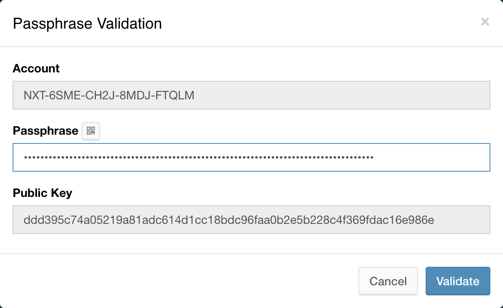
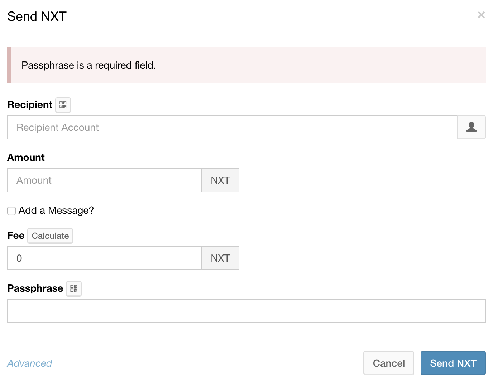

# NXT Wallet

## **Account Control**

Account security is the most important problem associated with the use of cryptocurrency. The NXT wallet is protected by the multisygnature method.

**Multisygnature method** allows users to create accounts that carry out transactions only with the approval of currency holders or subject transactions to Votes for expenses.

When a user creates a new account - a new passphrase with 12 words is generated. You can change these words on your own, but you must be careful about programmed bots that log into accounts with weak passwords, open them and transfer NTX to the account they control. You can not retrieve your NTX, so a strong password is important.

Each user has their own private key, passphase and public key. 

> Your public key, private key and account number are deterministically generated from the passphrase alone. Hence, **your passphrase is your account**. If someone has your passphrase, they have your account. Your public key is a special string of characters that other nodes use to verify your transactions.

## Transactions

Every transaction can be seen and traced, because the NXT transaction is not anonymous.

Typed of transactions:

* Sending/receiving NXT
* Assigning an alias and asset exchange transactions

Every interaction with NXT Blockchain require a Transaction Fee - usually 1 NTX.

> When receiving your first NXT, you'll need to tell the sender your public key. This only needs to be done for this first time, after that the network will know your public key.

* _Recipient_ - recipient account number ID
* _Amount_ - the amount of NXT to send
* Fee - minimum 1 NXT fee for interaction with NXT Blockchain
* Passphrase - your passphrase \(12 words\) to confirm your identity

If you press the button - Send NXT, the transaction will be created and sent to the peer network to enable the blockchain network for a fee of 1 NXT.

If you want to make the transaction phrased, you must click on the _Advanced_ link.

**NXT Phrasing** allows you to create a transaction with conditional deferred execution based on the result of voting, a list of related transactions or on the revelation of a secret.

* _Deadline \(Hours\)_ - deadline for inclusion of the transaction into a block
* _Eight phrasing voting model graphics_ 

  * None
  * Vote by Account - the number of accounts that must vote for approve the transaction, 

  every account has one vote

  * Vote By Account Balance **-** the minimum total amount of NXT needed to approve the 

  transaction, with each voting account contributing to the total its NXT balance

  * Vote By Asset Balance
  * Vote By Currency Balance
  * By Linked Transactions
  * By Secret - approved with hashed secret

## Another wallet functions

* Coin exchange \(Bitcoin, Litecoin, Ether to NXT and vice versa\)
* Voting System
* Money shuffling
* Messages to recipients
* Aliases

